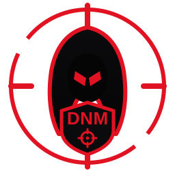

<p align="center">
  
  <br/>
  
  <br/>
  <b><i><big><big>Hunt bugs. Secure future.</big></big></i></b>
</p>

<p align="center">
  An AI-powered offensive-security platform for <b>bug-bounty hunters</b> and <b>penetration testers</b>.
  DNM-Hunter pairs an <b>autonomous AI agent pipeline</b> — which chains reconnaissance, exploitation,
  and post-exploitation, then triages findings, writes fixes, and opens pull requests — with a
  self-contained, <b>VRT-mapped scanner suite</b> (<code>nh-scan</code>) that audits source code,
  cloud/IaC, binaries, smart contracts, LLM apps, and live web targets, scoring every finding with
  CVSS and producing submission-ready reports and SARIF. From first packet to merged patch — and from
  a raw repository to a client-ready report — with human oversight at every critical step.
</p>

<p align="center">
  <a href="https://github.com/NisargDedakiya/DNM-hunter/stargazers"></a>
  
  
  
  
  
  
  
  
  
</p>

> **LEGAL DISCLAIMER** — DNM-Hunter is for **authorized security testing**, **education**, and **research only**. Never scan, probe, or attack a system you do not own or lack **explicit written permission** to test. Unauthorized access is **illegal**. By using this tool you accept **full responsibility** for your actions. **[Read the full disclaimer »](DISCLAIMER.md)**

---

## What is DNM-Hunter?

DNM-Hunter is two complementary engines behind one workspace:

1. **The scanner suite (`nh-scan`)** — a dependency-light, Bugcrowd-VRT-mapped static & dynamic analysis engine that a bug hunter or pentester can run against a folder, a GitHub repo, or a live URL and get back CVSS-scored, submission-ready findings in Markdown, HTML, or SARIF.
2. **The AI platform** — a Next.js web app plus an autonomous agent stack (recon orchestrator, Kali sandbox, knowledge graph) that plans and drives an engagement end-to-end, tracks your bug-bounty pipeline, and turns findings into client-ready reports.

You can use either half on its own: the scanner runs anywhere Python does (and in a single container), while the full platform runs via Docker.

---

## The scanner suite — `nh-scan`

One unified command fans out across purpose-built analyzers, deduplicates, scores, and reports.

| Module | What it finds |
|--------|---------------|
| **code_audit** (SAST) | SQLi, command injection / RCE, XXE, LFI/path traversal, SSTI, SSRF, insecure deserialization, weak crypto |
| **iac_scan** | Docker / Docker-Compose / Kubernetes / GitHub Actions / **Terraform** misconfigurations, incl. AWS · GCP · Azure cloud rules |
| **repo_scan** | Hard-coded secrets & credentials (240+ patterns) across any repo — clone a GitHub URL or scan a local tree |
| **contract_audit** | Solidity smart-contract flaws — reentrancy, `tx.origin` auth, unchecked calls, integer issues |
| **llm_audit** | OWASP **LLM Top 10** for AI-app source (prompt injection, insecure output handling, excessive agency…) |
| **binary_audit** / **deep_binary** | ELF hardening (`checksec`-style) & dangerous imports; optional **angr** symbolic execution |
| **os_audit** | Host-hardening config review + native-code (C/C++) vulnerability patterns |
| **web_probe** (DAST) | Live-HTTP checks — security headers, cookie flags, TLS, exposed surfaces |

**Every finding is** mapped to the **Bugcrowd VRT**, scored with **CVSS v3.1** (deterministic vectors), enriched with remediation guidance, and exportable as **SARIF 2.1.0** (GitHub code-scanning), **HTML**, or **Markdown**.

```bash
# install the suite (Python 3.10+)
python -m pip install -e ".[iac]"        # nh-* console scripts + IaC parsers

# scan a folder → HTML report
nh-scan ./path/to/target --format html -o report.html

# scan a live URL (DAST)
nh-web-probe https://example.com

# CI gate: non-zero exit when a high+ finding exists
nh-scan ./repo --fail-on high
```

Console scripts: `nh-scan` · `nh-web-probe` · `nh-code-audit` · `nh-contract-audit` · `nh-llm-audit` · `nh-binary-audit` · `nh-vrt-coverage`.

> Full module reference: **[docs/SECURITY_MODULES.md](docs/SECURITY_MODULES.md)**.

---

## The web platform

A Next.js workspace that turns scans into an engagement:

- **Self-serve accounts** — register, sign in, and start scanning in under a minute.
- **Home & Dashboard** — plan/quota at a glance, recent scans, program pipeline, tool health.
- **In-app scans** — run a live URL or GitHub repo, browse findings by severity · CVSS · VRT, and export the report.
- **Bug-Hunter cockpit** — track programs and submissions, earnings and acceptance rate, and turn any finding into a submission.
- **Shareable reports** — send a client a read-only, tokenized report link.
- **Subscriptions** — Free / Pro / Team plans with quota metering (billing runs in an offline mock until a Stripe key is set).
- **Autonomous agent (Red Zone)** — recon orchestration, a Kali tool sandbox, and an attack-surface knowledge graph, with configurable autonomy and rules-of-engagement guardrails.

Hardened with JWT session auth, RBAC, per-IP rate limiting, and request-ID structured logging.

> Web app internals: **[readmes/README.WEBAPP.md](readmes/README.WEBAPP.md)**.

---

## Quick start

### Option A — Full platform (Docker)

Runs everything: web app, PostgreSQL, Neo4j, the scanners, and the agent. On **Windows**, use Docker Desktop with the WSL2 backend.

```bash
git clone https://github.com/NisargDedakiya/DNM-hunter.git
cd DNM-hunter
./starthunt                        # one command: starts the WHOLE stack
# open http://localhost:3000
```

`./starthunt` is the one-command launcher — it installs on the first run and just
starts on every run after, bringing up the whole platform (web app, PostgreSQL,
Neo4j, docker-broker, recon-orchestrator, kali-sandbox, and the AI agent), then
prints the URL. On **Windows** run `starthunt` from CMD/PowerShell (it hands off
to Git Bash/WSL).

```bash
./starthunt          # start everything          ./starthunt stop     # stop (data kept)
./starthunt dev      # dev mode (hot-reload)      ./starthunt status   # what's running
./starthunt logs     # tail logs                  ./starthunt update   # pull + rebuild
```

Prefer the raw orchestrator? `./nisarghunter.sh install | up | status | stop | update`
does the same. Add `--gvm` for OpenVAS or `--kbase` for the local AI knowledge base.

### Option B — Scanner container (zero host installs)

```bash
docker build -f Dockerfile.scanner -t dnm-hunter-scan .
docker run --rm -v "$PWD:/target" dnm-hunter-scan nh-scan /target --format html -o /target/report.html
```

### Option C — Native

Python 3.10+ for the scanner (`pip install -e ".[iac]"`); Node 20+ and PostgreSQL 14+ for the web app.

> Platform-by-platform details (incl. Windows): **[SETUP.md](SETUP.md)**.

---

## Documentation

| Topic | Doc |
|-------|-----|
| Setup & running (Windows/macOS/Linux) | [SETUP.md](SETUP.md) |
| Security modules / scanner reference | [docs/SECURITY_MODULES.md](docs/SECURITY_MODULES.md) |
| Architecture | [readmes/ARCHITECTURE.md](readmes/ARCHITECTURE.md) |
| Tech stack | [readmes/TECH_STACK.md](readmes/TECH_STACK.md) |
| Developer guide | [readmes/README.DEV.md](readmes/README.DEV.md) |
| Web app | [readmes/README.WEBAPP.md](readmes/README.WEBAPP.md) |
| Agentic system | [readmes/README.AGENTIC_SYSTEM.md](readmes/README.AGENTIC_SYSTEM.md) |
| Troubleshooting | [readmes/TROUBLESHOOTING.md](readmes/TROUBLESHOOTING.md) |
| Changelog | [CHANGELOG.md](CHANGELOG.md) |

---

## Contributing

Contributions are welcome — see **[CONTRIBUTING.md](CONTRIBUTING.md)** for setup, code style, and the pull-request process. Security reports: **[SECURITY.md](SECURITY.md)**.

---

## Maintainer

**DNM-Hunter** is developed and maintained by **[Nisarg Dedakiya](https://github.com/NisargDedakiya)**.
Questions, feedback, or collaboration → open an issue on the **[repository](https://github.com/NisargDedakiya/DNM-hunter/issues)**.

---

## Legal

> **LOCAL USE ONLY** — DNM-Hunter is designed to run on a **local machine** and has **not** been hardened for public/internet-facing deployment. Do not expose it on a public server; running it outside a trusted local network is at your own risk.

Released under the **[MIT License](LICENSE)**. DNM-Hunter bundles third-party tools under their own licenses (MIT, Apache-2.0, BSD, GPL, AGPL, LGPL, and the WPScan Public Source License); the full inventory and obligations — including the WPScan **commercial-use** restriction — are documented in **[THIRD-PARTY-LICENSES.md](THIRD-PARTY-LICENSES.md)**. See **[DISCLAIMER.md](DISCLAIMER.md)** for the acceptable-use policy and legal terms.

<p align="center">
  <br/>
  <strong>Use responsibly. Test ethically. Defend better.</strong>
</p>
